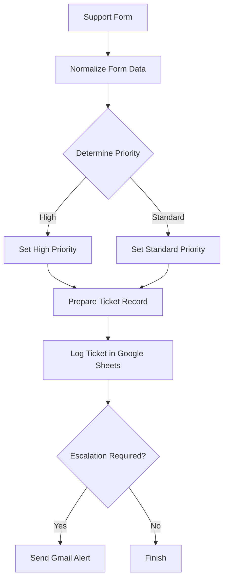

# n8n Support Ticket Triage

A production-ready n8n workflow that receives customer support requests, classifies their priority, assigns response targets, records tickets in Google Sheets, and sends Gmail alerts when escalation is required.

## Business Problem

Support teams often receive requests through multiple channels and must manually:

* Copy customer information into a tracking system
* Decide whether a ticket is urgent
* Assign a priority and response time
* Notify the responsible person
* Maintain an accurate ticket log

This process can be slow, inconsistent, and vulnerable to missed high-priority requests.

## Solution

This workflow provides a structured support form and automatically processes every submission.

It:

1. Collects customer and issue information
2. Normalizes the submitted data
3. Checks urgency and support-related keywords
4. Assigns High or Standard priority
5. Sets the appropriate response SLA
6. Creates a consistent ticket record
7. Logs the ticket in Google Sheets
8. Sends a Gmail alert only when escalation is required

## Workflow Overview



## Tools Used

* n8n Cloud
* n8n Form Trigger
* Edit Fields nodes
* IF nodes
* Google Sheets
* Gmail
* Expressions and Boolean logic

## Form Fields

The customer support form collects:

| Field           | Purpose                                 |
| --------------- | --------------------------------------- |
| Customer Name   | Identifies the customer                 |
| Customer Email  | Provides contact information            |
| Subject         | Summarizes the request                  |
| Message         | Contains the full issue                 |
| Urgent Response | Allows the customer to indicate urgency |

## Priority Rules

A ticket becomes **High priority** when any configured condition is true.

The workflow uses OR logic for:

* Customer selected urgent response
* Subject or message contains `refund`
* Subject or message contains `payment failed`
* Subject or message contains `account access`
* Subject or message contains `locked out`

If none of these conditions match, the ticket is assigned Standard priority.

| Priority | Response SLA | Escalation   |
| -------- | -----------: | ------------ |
| High     |      2 hours | Required     |
| Standard |     24 hours | Not required |

## Node-by-Node Explanation

### 1. On form submission

Starts the workflow when a customer submits the production support form.

### 2. Normalize Form Data

Creates a consistent data structure and:

* Generates a ticket ID
* Maps the customer fields
* Converts the urgency response into a Boolean value
* Sets the initial status to `New`

Example ticket ID expression:

```javascript
{{ 'TKT-' + $now.toMillis() }}
```

Urgency conversion:

```javascript
{{ $json.urgent_response === 'Yes' }}
```

### 3. Determine Priority

Checks the urgency value and searches the combined subject and message for priority keywords.

Example combined-text expression:

```javascript
{{ ($json.subject + ' ' + $json.message).toLowerCase() }}
```

The conditions use OR logic so one matching rule is enough to create a High-priority ticket.

### 4. Set High Priority

Adds:

```text
priority: High
response_sla_hours: 2
escalation_required: true
```

### 5. Set Standard Priority

Adds:

```text
priority: Standard
response_sla_hours: 24
escalation_required: false
```

### 6. Prepare Ticket Record

Creates the final standardized ticket record with:

* Ticket ID
* Triage timestamp
* Customer name
* Customer email
* Subject
* Message
* Urgency
* Priority
* Response SLA
* Escalation requirement
* Status

The final status is set to `Triaged`.

Timestamp expression:

```javascript
{{ $now.toISO() }}
```

### 7. Log Ticket in Google Sheets

Appends each processed ticket to a central support log for tracking and reporting.

### 8. Escalation Required?

Checks whether:

```javascript
{{ $json.escalation_required }}
```

is true.

### 9. Send Escalation Alert

Sends a Gmail notification for High-priority tickets only. Standard tickets finish without generating an unnecessary alert.

## Google Sheets Output

Each ticket is recorded with the following columns:

```text
ticket_id
triaged_at
customer_name
customer_email
subject
message
urgent
priority
response_sla_hours
escalation_required
status
```

## Testing

The workflow was tested with multiple scenarios.

| Scenario                   | Expected Result                | Result |
| -------------------------- | ------------------------------ | ------ |
| Urgent request             | High priority and email alert  | Passed |
| Refund keyword             | High priority and email alert  | Passed |
| Payment failure keyword    | High priority and email alert  | Passed |
| Standard delivery question | Standard priority and no email | Passed |
| Production form submission | Ticket logged successfully     | Passed |

Both the High and Standard branches were tested end to end.

## Troubleshooting and Design Decisions

### OR instead of AND

OR logic was selected because a ticket should become High priority when any priority condition matches. AND logic would incorrectly require every condition to be true.

### Removed the Merge node

A Merge node in Append mode waited for data from both priority branches. The IF node sends each ticket through only one branch, so both priority nodes were connected directly to the shared preparation node.

### Explicit final field mapping

The Prepare Ticket Record node explicitly maps the final fields. This prevents duplicate fields and ensures the final status and timestamp are consistent.

### Refreshed Google Sheets mappings

After spreadsheet column names were standardized, the Google Sheets node mappings were refreshed and verified.

## Business Value

This workflow can help a support team:

* Respond faster to urgent issues
* Apply consistent priority rules
* Reduce manual data entry
* Maintain a structured ticket history
* Prevent important requests from being overlooked
* Reduce unnecessary notifications for routine requests

## Security and Privacy

The public project documentation does not contain:

* Account credentials
* API keys
* Private form URLs
* Google Sheet IDs
* Personal customer data
* Private email addresses

## Future Improvements

Possible extensions include:

* Dedicated error notifications
* Slack or Microsoft Teams escalation
* Automatic customer confirmation emails
* AI-based ticket categorization
* Duplicate-ticket detection
* Ticket assignment by department
* SLA breach reminders
* Dashboard reporting

## Project Status

**Completed, published, and production-tested.**
