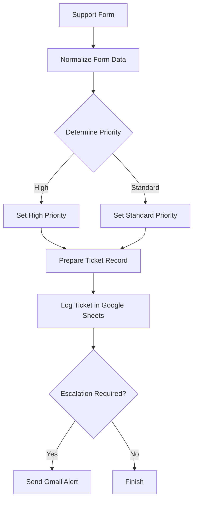
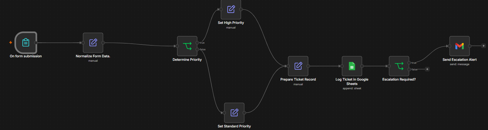
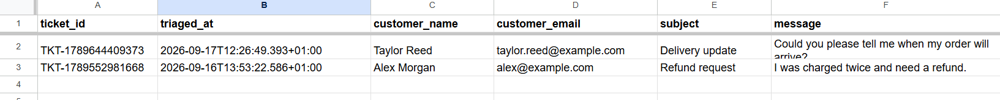
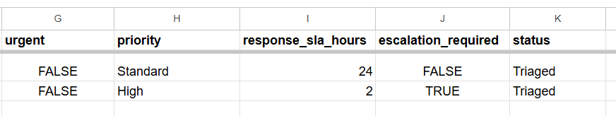

# n8n Support Ticket Triage

I built this project to practise creating a complete n8n workflow that solves a realistic customer-support problem.

The workflow collects support requests through a form, decides whether each ticket is High or Standard priority, assigns a response time, records the ticket in Google Sheets, and sends a Gmail alert when escalation is needed.

## The Problem I Wanted to Solve

A small support team may receive many customer requests during the day. Someone then has to read each request, decide how urgent it is, record the details, and notify the right person.

Doing this manually takes time and creates several risks:

* Urgent tickets may be missed
* Priority decisions may be inconsistent
* Customer information may be copied incorrectly
* Response targets may not be assigned
* Routine tickets may create unnecessary notifications

I wanted to create one workflow that handled these steps consistently.

## What the Workflow Does

When a customer submits the support form, the workflow:

1. Collects the customer’s name, email address, subject, message, and urgency choice
2. Normalizes the submitted data
3. Generates a unique ticket ID
4. Checks the ticket against urgency and keyword rules
5. Assigns High or Standard priority
6. Sets a response SLA
7. Creates a clean ticket record
8. Adds the ticket to Google Sheets
9. Sends a Gmail alert only when escalation is required

## Workflow Diagram



## Project Screenshots

All customer details shown below are fictional and were created for testing.

### Complete Workflow



### Ticket Details in Google Sheets



### Priority and Escalation Results



## Tools Used

* n8n Cloud
* n8n Form Trigger
* Edit Fields nodes
* IF nodes
* Google Sheets
* Gmail
* n8n expressions
* Boolean and OR logic

## Form Fields

The support form collects five pieces of information:

| Field           | Purpose                              |
| --------------- | ------------------------------------ |
| Customer Name   | Identifies the customer              |
| Customer Email  | Provides contact information         |
| Subject         | Gives a short summary of the issue   |
| Message         | Contains the customer’s full request |
| Urgent Response | Lets the customer indicate urgency   |

## How Priority Is Decided

The workflow treats a ticket as High priority when at least one priority condition is true.

The conditions use **OR logic** because a single urgent signal should be enough to escalate a ticket. Using AND logic would require every condition to be true, which would allow important tickets to be missed.

The High-priority conditions are:

* The customer selects an urgent response
* The subject or message contains `refund`
* The subject or message contains `payment failed`
* The subject or message contains `account access`
* The subject or message contains `locked out`

If none of these rules match, the ticket follows the Standard branch.

| Priority | Response SLA | Escalation   |
| -------- | -----------: | ------------ |
| High     |      2 hours | Required     |
| Standard |     24 hours | Not required |

## How Each Node Works

### 1. On form submission

This node starts the workflow when a customer submits the production support form.

### 2. Normalize Form Data

This Edit Fields node gives the data consistent field names and creates the initial ticket information.

The ticket ID is generated with:

```javascript
{{ 'TKT-' + $now.toMillis() }}
```

The Yes/No urgency answer is converted into a Boolean value with:

```javascript
{{ $json.urgent_response === 'Yes' }}
```

The initial ticket status is set to `New`.

### 3. Determine Priority

This IF node checks the Boolean urgency value and searches the subject and message for the configured keywords.

The subject and message are combined and converted to lowercase:

```javascript
{{ ($json.subject + ' ' + $json.message).toLowerCase() }}
```

Converting the text to lowercase makes the keyword checks more consistent.

### 4. Set High Priority

A High-priority ticket receives:

```text
priority: High
response_sla_hours: 2
escalation_required: true
```

### 5. Set Standard Priority

A Standard ticket receives:

```text
priority: Standard
response_sla_hours: 24
escalation_required: false
```

### 6. Prepare Ticket Record

This node creates the final structure that will be sent to Google Sheets.

It includes:

* Ticket ID
* Triage timestamp
* Customer name
* Customer email
* Subject
* Message
* Urgency
* Priority
* Response SLA
* Escalation requirement
* Status

The final status is changed to `Triaged`.

The timestamp is generated with:

```javascript
{{ $now.toISO() }}
```

I also added fallback logic for the priority and SLA fields:

```javascript
{{ $json.priority ?? ($json.escalation_required ? 'High' : 'Standard') }}
```

```javascript
{{ $json.response_sla_hours ?? ($json.escalation_required ? 2 : 24) }}
```

These expressions use the upstream values when available. If a value is missing, the workflow derives the correct result from the escalation flag.

### 7. Log Ticket in Google Sheets

This node appends the final ticket record to a Google Sheets log.

The sheet contains:

```text
ticket_id
triaged_at
customer_name
customer_email
subject
message
urgent
priority
response_sla_hours
escalation_required
status
```

### 8. Escalation Required?

This IF node checks:

```javascript
{{ $json.escalation_required }}
```

If the value is true, the ticket continues to Gmail. If it is false, the workflow finishes without sending an alert.

### 9. Send Escalation Alert

This node sends an email containing the ticket ID, customer information, issue details, priority, SLA, status, and triage time.

Only escalated tickets reach this node.

## Testing

I tested both workflow branches with fictional customer information.

| Test                            | Expected Result              | Outcome |
| ------------------------------- | ---------------------------- | ------- |
| Urgent response selected        | High, 2 hours, email alert   | Passed  |
| Refund keyword present          | High, 2 hours, email alert   | Passed  |
| Payment failure keyword present | High, 2 hours, email alert   | Passed  |
| Normal delivery question        | Standard, 24 hours, no email | Passed  |
| Production form submission      | New Google Sheets row        | Passed  |

I also confirmed that Standard tickets do not trigger Gmail.

## Problems I Solved

### Form.io was not the correct trigger

I initially selected the Form.io Trigger. I replaced it with n8n’s native Form Trigger so the form could be created and managed directly inside n8n.

### The Merge node waited for both branches

I originally added a Merge node after the High and Standard branches.

The Merge node in Append mode waited for data from both branches, but an IF node sends each ticket through only one branch. I removed the Merge node and connected both priority nodes directly to Prepare Ticket Record.

### Duplicate status fields appeared

The incoming data contained `status: New`, while the preparation node added `status: Triaged`.

I fixed this by explicitly mapping the final fields and keeping **Include Other Input Fields** turned off in Prepare Ticket Record.

### Google Sheets mappings needed refreshing

After changing spreadsheet column names, the Google Sheets node still remembered the old headers.

I refreshed the sheet fields and rebuilt the mappings using consistent names such as:

```text
customer_name
customer_email
```

### Standard priority values became null

The Standard node correctly produced `Standard` and `24`, but the preparation step returned null values during a production execution.

I corrected the data types and added fallback expressions in Prepare Ticket Record. A new production test then recorded:

```text
Standard | 24 | FALSE | Triaged
```

## What I Learned

This project helped me understand that building a workflow is only part of the job. The data must also be checked at every stage.

My troubleshooting process was:

1. Find the last node with correct output
2. Open the next node
3. Compare its input and output
4. Change one setting at a time
5. Run a fresh test
6. Verify the result in the final connected system

This approach helped me find problems in the branching, field mapping, data types, and published workflow behaviour.

## Business Value

This workflow can help a support team:

* Respond to urgent requests faster
* Apply consistent priority rules
* Reduce manual data entry
* Maintain a searchable ticket log
* Assign clear response targets
* Avoid unnecessary email alerts
* Reduce the risk of missing important customer issues

## Privacy and Security

The public repository does not include:

* Login credentials
* API keys
* Private form URLs
* Google Sheet IDs
* Credential identifiers
* Real customer information
* Personal recipient email addresses

All information shown in the screenshots is fictional test data.

## Possible Improvements

Future versions could include:

* Error notifications
* Customer confirmation emails
* Slack or Microsoft Teams alerts
* AI-based ticket categories
* Automatic department assignment
* Duplicate-ticket detection
* SLA breach reminders
* Dashboard reporting

## Project Status

Completed, published, and tested through the production form.
